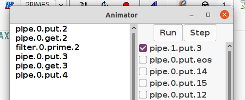
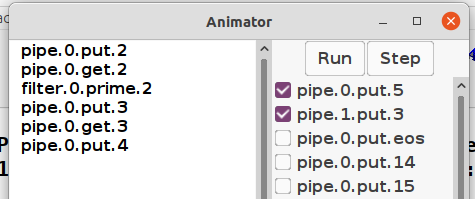

# Taller 4

Grupo F (#6)

| Nombre            | Mail                    | LU     |
| ----------------- | ----------------------- | ------ |
| Manuel Panichelli | panicmanu@gmail.com     | 72/18  |
| Elias Cerdeira    | eliascerdeira@gmail.com | 692/12 |

El código de los ejercicios que hicimos está en archivos `ej{número}.lts`.

## Ejercicio 4

El modelado inicial está en [`ej4.lts`](ejercicios/entregables/ej4.lts) y el que
no supone nada sobre la velocidad de respueta del sensor en
[`ej4b.lts`](ejercicios/entregables/ej4b.lts).

El primero no modela que lleguen interrupciones del sensor de agua mientras se
atiende una petición de nivel, mientras que el segundo sí.

## Ejercicio 5

Modelado en [`ej5.lts`](ejercicios/entregables/ej5.lts)

```lts
// Ej 5

AGUA = AGUA[5],
AGUA[i:0..10] = (
	when (i < 10) agua[i+1] -> AGUA[i+1] | 
	when (i > 0) agua[i-1] -> AGUA[i-1] 
).

// Ej 4.a
range Bajo = 0..2
range Medio = 3..7
range Alto = 8..10
SENSOR = (
	agua[i:Bajo] -> BAJO |
	agua[i:Medio] -> MEDIO |
	agua[i:Alto] -> ALTO
),
BAJO = (
	nivel -> bajo -> BAJO |
	agua[i:Bajo] -> BAJO |
	agua[i:Medio] -> MEDIO |
	agua[i:Alto] -> ALTO
),
MEDIO = (
	nivel -> medio -> MEDIO |
	agua[i:Bajo] -> BAJO |
	agua[i:Medio] -> MEDIO |
	agua[i:Alto] -> ALTO
),
ALTO = (
	nivel -> alto -> ALTO |
	agua[i:Bajo] -> BAJO |
	agua[i:Medio] -> MEDIO |
	agua[i:Alto] -> ALTO
).

||SENSOR_AGUA = (SENSOR || AGUA).
```

## Ejercicio 7

Modelado en [`ej7.lts`](ejercicios/entregables/ej7.lts).

```lts
range R = 0..7
VARIABLE = VARIABLE[3],
VARIABLE[i:R] = (
	read[i] -> VARIABLE[i] |
	write[j:R] -> VARIABLE[j] |
	write[8]-> overflow -> STOP |
	write[-1] -> underflow -> STOP
).

SUMA1 = (read[i:R] -> write[i+1] -> SUMA1) + {write[-1], write[0]}.
RESTA1 = (read[i:R] -> write[i-1] -> RESTA1) + {write[7], write[8]}.

||COMP = (
	{inc, dec}::VARIABLE
	|| dec:RESTA1
	|| inc:SUMA1
).
```

Trazas:

- La variable da overflow

  ```text
  inc.read.3
  inc.write.4
  inc.read.4
  inc.write.5
  inc.read.5
  inc.write.6
  inc.read.6
  inc.write.7
  inc.read.7
  inc.write.8
  inc.overflow
  STOP
  ```

- La variable da underflow

  ```text
  dec.read.3
  dec.write.2
  dec.read.2
  dec.write.1
  dec.read.1
  dec.write.0
  dec.read.0
  dec.write.-1
  dec.underflow
  STOP
  ```

- Nunca sucede under o overflow

  > Acá asumimos que se pedía una traza de operar normalmente con la variable y
  > no una demostración de que no podría suceder.

  ```text
  inc.read.3
  inc.write.4
  inc.read.4
  inc.write.5
  inc.read.5
  inc.write.6
  dec.read.6
  dec.write.5
  dec.read.5
  dec.write.4
  inc.read.4
  inc.write.5
  dec.read.5
  dec.write.4
  inc.read.4
  inc.write.5
  dec.read.5
  dec.write.4
  ```

- Los procesos se interfieren resultando en una actualización incorrecta (una
  race condition)

  ```text
  inc.read.3
  dec.read.3
  inc.write.4
  dec.write.2
  ```

## Ejercicio 10

- b. Estructura:

  

- c. El modelado copiado está en [`ej10.lts`](ejercicios/entregables/ej10.lts) y
  la modificación para que soporte buffers de dos en
  [`ej10c.lts`](ejercicios/entregables/ej10c.lts).

  ```diff
  -PIPE = (put[x:S]->get[x]->PIPE).
  +PIPE = (put[x:S] -> PIPE[x]),
  +PIPE[x:S] = (
  +	put[y:S] -> (get[x] -> PIPE[y]) |
  +	get[x] -> PIPE
  +).
  ```

  En el primero, para cada put si o si hay que seguir con un get. En el segundo,
  luego de un put se puede

  - hacer un get, en cuyo caso la variable vuelve a estar vacía, o
  - hacer un put, en cuyo caso solo se puede hacer un get del primer valor
    introducido (modelamos buffers FIFO).

- d. La arquitectura de dos buffers permite mayor concurrencia ya que permite
  que cuando un proceso *downstream* se traba, el resto siga procesando hasta
  que el buffer se llene.

  - En el sistema original, cuando el filter 1 no procesa el input, el 0 se
    queda trabado

    
  
  - En cambio para la misma traza, en el sistema que tiene pipes buffereados,
    cuando el filter 1 se traba, el 0 puede procesar el siguiente número

    

    Observar que se permite la acción `pipe.0.put.5` que no está en el anterior.